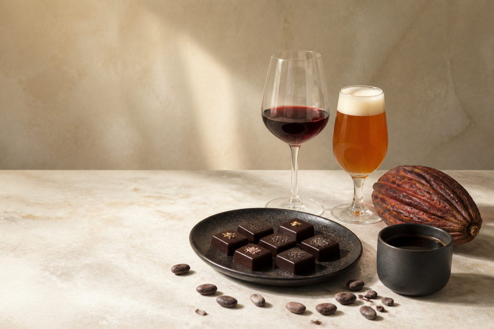

# Azoth Chocolate

An editorial landing page for Azoth Chocolate's educational fine-chocolate tasting and beverage-pairing experiences.



## About

Azoth Chocolate collaborates with breweries, wineries, and coffee roasters to create guided tasting experiences around three programs:

- Cacao & Cup — coffee pairings
- Cacao & Craft — beer pairings
- Cacao & Vine — wine pairings

The site presents the programs, guest journey, hosting process, founder credentials, and an email-based venue inquiry call to action.

## Technology

- Angular 22
- TypeScript 6
- Angular SSR and prerendering
- SCSS with a shared semantic color system
- Vitest component tests
- Self-hosted Newsreader and Manrope variable fonts

## Local development

Install the pinned dependencies:

```bash
npm ci
```

Start the Angular development server:

```bash
npm start
```

Open [http://localhost:4200](http://localhost:4200). The page reloads automatically when source files change.

## Quality checks

Run the unit suite once:

```bash
npm test -- --watch=false
```

Create an optimized production build:

```bash
npm run build
```

The production artifacts are written to `dist/cloudflare`. The browser-ready files
deployed to Cloudflare Workers are in `dist/cloudflare/browser`.

To run the built SSR application locally:

```bash
npm run serve:ssr:azoth
```

## Project structure

```text
public/
  images/                 Editorial photography
src/
  app/
    components/           Landing-page sections and shared icon component
    declarations/         Shared application interfaces
  assets/                 Azoth and pairing-program SVG artwork
  styles.scss             Global tokens, reset, typography, and utilities
```

## Content and branding

Azoth's logo artwork and the Cacao & Cup, Cacao & Craft, and Cacao & Vine program marks live in `src/assets`. Keep their proportions intact when placing them in new layouts.

The page uses fragment navigation and remains a single-page experience. Hosting inquiries open a pre-addressed email to `hello@azothchocolate.com`; there is no form backend.

## Deployment

The landing page is deployed as prerendered static assets on Cloudflare Workers.
The Worker configuration in `wrangler.jsonc` uploads `dist/cloudflare/browser`
and provides an SPA fallback for navigation requests.

In Cloudflare Workers Builds, use:

```text
Build command: npm run build
Deploy command: npx wrangler deploy
Root directory: /
```

Pushes to the production branch will build and deploy the site to the Worker and
its configured custom domains.

## Rights

Copyright © 2026 Azoth Chocolate. All rights reserved.
